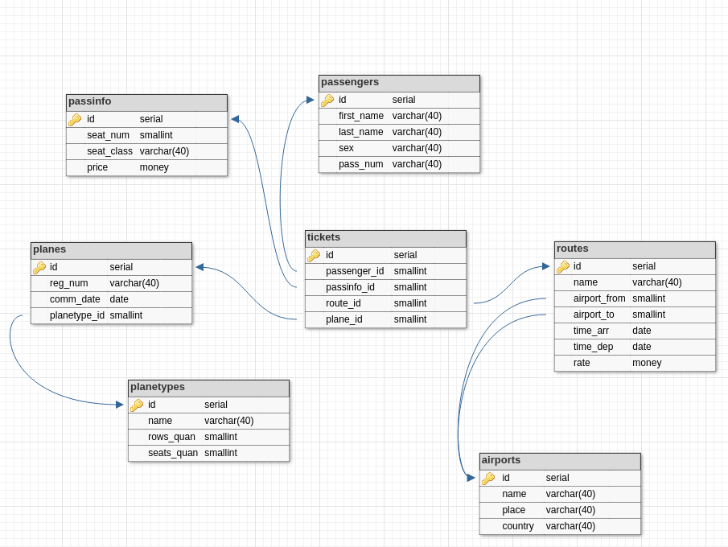

## About

Labs and a part of coursework completed during Database course:
- lab_1.sql - window functions
- lab_2.py - psycopg2
- lab_3.sql - recursive
- lab_4.sql - crosstab
- lab_5.js - mongo
- queries.sql - queries for coursework

## Database Schema (Coursework)

